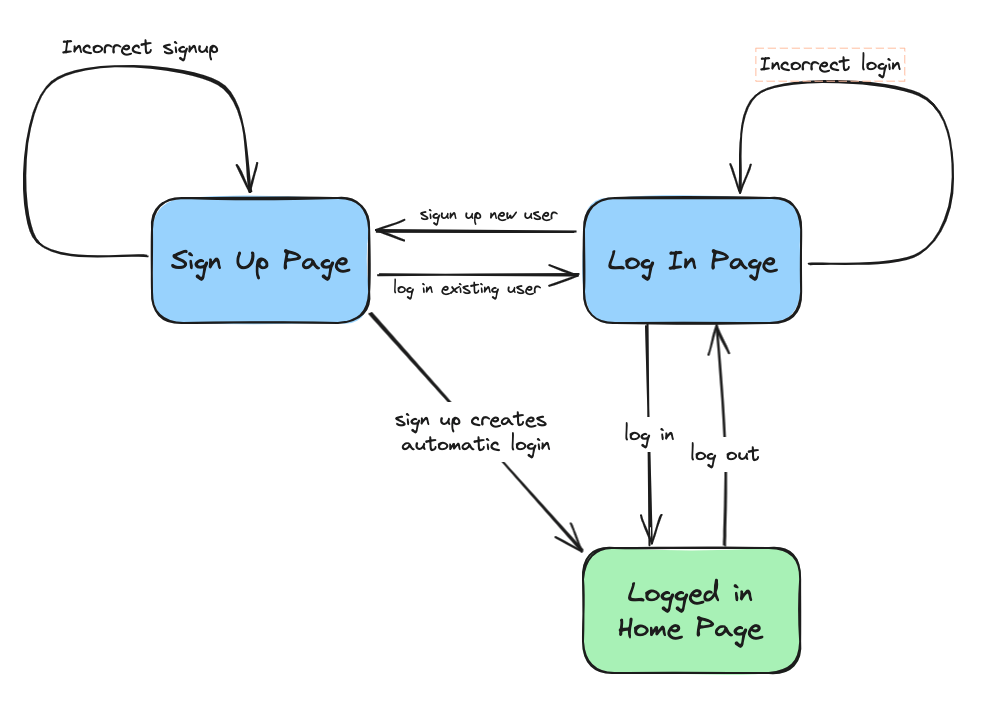

# Extended Testing Phase 1 Step 5 State Transitions Challenge

## Challenge

This is a process feedback challenge. For this challenge, you won't be submitting a video but instead you'll be providing a link to GitHub where you've put resources you've created.

Work through the following steps to produce a state transition diagram, from that produce a state transition table, then plan a hypothetical test case.

Write down the different states e.g. sign-up page
Write down the different events e.g. user logs in
Determine which events cause a transition between one state and another
Make this into a state transition diagram
Draw up a state transition table, based on your diagram, populating the table below
Design a test case that covers all states and all events/transitions at least once i.e. what is the starting state and what events (in what order) are required
Commit your resources (state transition diagram, state transition table and test case) to GitHub and submit your challenge

## Our assumptions

* The home page is only accessible when logged in
* A successful sign up will automatically log the new user in and take them directly to the homepage of the app.
* We considered all the log in and sign up combinations, refined them (shown in the table below) and agreed on appropriate state results.

## State Transition Diagram

## State Transtions Table
| Initial State  | Event  | Next State |
| ------------ | ------------ | -------- |
| Sign up page | Email: valid, password: valid | Home Page |
| Sign up page | Email: invalid, password: valid | Sign Up Page |
| Sign up page | Email: invalid, password: invalid | Sign Up Page |
| Sign up page | Email: valid, password: invalid | Sign Up Page |
| Sign up page | Email: blank, password: any | Sign Up Page |
| Sign up page | Email: any, password: blank | Sign Up Page |
| Sign up page | Click Log in Link button | Log in Page |
|||
| Log in page | Email: signed up, password: valid | Home Page |
| Log in page | Email: signed up, password: invalid | Log in page |
| Log in page | Email: unknown, password: valid | Log in page |
| Log in page | Email: unknown, password: invalid | Log in page |
| Log in page | Email: any, password: blank | Log in page |
| Log in page | Email: blank, password: any | Log in page |
| Log in page | Click Sign Up Link | Sign Up page |
|||
| Home page | Click Log Out button | Log in page |

## Test covering all states and transitions

* START: Sign up page 
* Email: invalid, password: valid => Sign up page
* Email: valid , password: invalid => Sign up page
* Email: blank , password: any => Sign up page
* Email: any , password: blank => Sign up page
* Email: blank , password: blank => Sign up page
* Email: valid, password: valid => Home Page
* Click Log Out button => Log in page
* Email: signed up, password: invalid => Log in page
* Email: unknown, password: valid => Log in page 
* Email: unknown, password: invalid => Log in page 
* Email: any, password: blank => Log in page 
* Email: blank, password: any => Log in page 
* Click Sign Up Link => Sign Up page
* Click Log in Link button => Log in Page
* Email: signed up, password: valid => Home Page

## Other Considerations
* We considered other behaviours of a successful signup, e.g. redirection to log in page or a requirement for email verification after signing up.
* We decided to analyse the different sign up and login behaviours separately so it was clear that we have considered the different possible state changes that could occur. As a consequence the single event, `incorrect login details` has become several different events in out `State Transitions Table` and resulted in many more transitions to be covered in our single test. In another situation, given the state results, these might be entered as a single event.